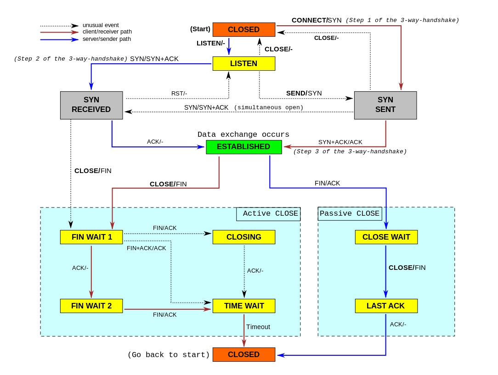

# unclassified

## header中的keep-alive
http（应用层）是无连接的协议，每次请求结束后会关闭tcp链接（传输层），使用keep-alive即可多次http请求使用同一个tcp链接
http 1.0中默认关闭，http 1.1中默认开启

## http中的connect方法？
该方法可以开启一个客户端与所请求资源之间的双向沟通通道，可以用来创建隧道（tunnel）

## tunnel是什么？
tunnel即为隧道代理。
简而言之，就是在客户端和真正的服务器建立TCP连接，然后对两者间的数据通讯进行直接转发。
适用场景是因为普通代理只能转发http请求，而无法处理其他协议的请求

## 如何理解“https over http”?
通过tunnel使得普通http代理可转发https请求？

## ws协议？wss协议？
ws指的是websocket协议，wss指的是基于ssl的websocket协议
websocket协议是一种网络通讯协议，出现的目的是为了解决http协议只能由客户端发起的问题

## tcp/ip的网络分层？
自下而上为：数据链路层       | 网络层 | 传输层 | 应用层  
OSI七层为：物理层 数据链路层 | 网络层 | 传输层 | 会话层 表示层 应用层

## 同一局域网内两个代理，是否https下通过代理A建立连接后，再通过代理B连接时，需要重连才能拦截数据？
经测试确实如此，推测是因为如果在wifi中将代理从A修改为B时，app已经通过代理A建立https连接，那么即使已经指定代理为B，app依旧会从代理A请求数据
扩展阅读：

## RSA如何进行数字签名？
签名过程：对信息进行hash计算得到摘要，对摘要使用私钥加密得到数字签名，并附在使用私钥加密的信息后面  
验证过程：获取签名后使用公钥解密得到摘要，同时使用公钥解密内容，然后计算摘要进行对比，如果一致，说明信息并未被篡改  
主要用于数据完整性保证、身份认证

## CA证书(Certificate Authority)的作用？
一个具有公信力的认证机构（CA）使用自己的私钥对Bob的公钥和个人信息进行签名生成证书，alice使用CA的公钥验证Bob真伪
主要用于防止公钥被篡改

## tcp的状态？
