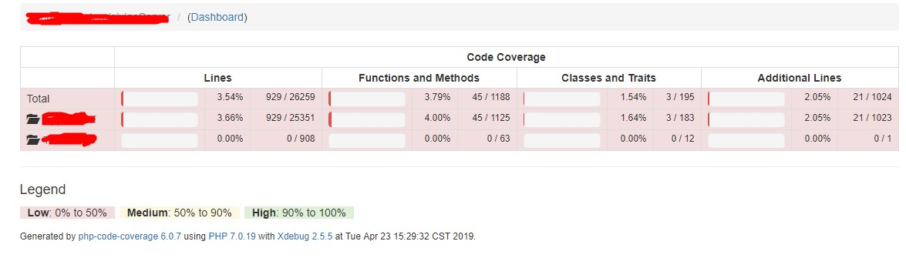
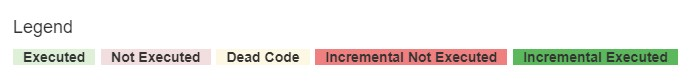

# 基于php-code-coverage的增量代码覆盖率实现

代码覆盖率作为一个指导性指标，可以一定程度上反应测试的完备程度，虽然100%覆盖的代码并不意味着100%无bug的应用，但是较高的覆盖率一般情况下也意味着更少的bug。近期笔者参与的一个项目代码量不断膨胀，但是自动化测试还不够完备，单纯依赖人工测试很容易出现旧功能受影响或测试遗漏的情况。为了降低测试对人力的消耗，尝试引入自动化测试对部分功能进行覆盖，并用增量代码覆盖率统计查看是否有测试点遗漏。这篇文章主要讲一个增量代码覆盖率的实现。

## 实现说明
这里简单说明下PHP增量代码覆盖率统计功能的实现方式，供感兴趣的同学参考

环境依赖
1. **xdebug**: php插件，用于收集覆盖率信息
2. **git**: 利用`git diff`获取增量代码信息
3. **php-code-coverage**: phpunit下的一个库，用于从xdebug收集的覆盖率信息中生成覆盖率统计报告，支持xml、html等多种格式。本文基于6.0.7改造以支持增量覆盖率统计，利用1.和2.中获取的信息生成增量覆盖率统计报告

具体实现说明如下：
1. xdebug安装  
    首先下载插件，xdebug官方下载地址：[http://xdebug.org.cn/download.php](http://xdebug.org.cn/download.php)。  
    然后根据操作系统的差异，windows根据当前系统位数、php版本以及是否线程安全，下载编译好的.dll文件；linux系统则需要下载源码后使用phpize编译成.so文件  
    然后在php.ini文件中指明插件的位置，并启用覆盖率收集功能如下所示：
    ```ini
    ; xdebug插件位置
    zend_extension ="/you/path/to/xdebug"
    ; 启用覆盖率功能
    xdebug.coverage_enable = 1
    ```
    使用`php -m`, 回显结果中出现Xdebug，则表示安装成功

2. 覆盖率信息收集  
    在项目入口文件中通过检查传入系是否存在trigger，来决定是否启动覆盖率信息收集，以常见的nginx+php项目举例实现方式如下：
    1. 通过php.ini的auto_prepend_file配置加载覆盖率收集文件
    2. 通过nginx检查cookie中是否存在trigger，来决定是否通过fastcgi_param向php传递trigger（随意命名，比如XDEBUG_COVERAGE_START)
    3. php的auto_prepend_file的$_SERVER中如果检查到存在trigger，则开启覆盖率收集
    ```php
    <?php
    xdebug_start_code_coverage(XDEBUG_CC_UNUSED | XDEBUG_CC_DEAD_CODE);

    register_shutdown_function(function () {
        $coverageData = xdebug_get_code_coverage();
        xdebug_stop_code_coverage();

        file_put_contents( __DIR__ . '/../data/coverage_'.uniqid().'.json', json_encode($coverageData));
    });
    ```

3. 增量代码信息获取
    使用`git diff $(git describe --tags --abbrev=0 $commit_id) $commit_id`获取当前$commit_id到最近一个版本之间的代码增量信息(与具体业务相关)，利用正则解析，将所有的增量信息解析为类似覆盖率信息的文件：
    ```json
    {
        "/you/path/to/code.php": {
            "1": 1,
            "2": 1,
            "3": 1
        }
    }
    ```

4. 生成覆盖率报告
    调整php-code-coverage，在其基础上增加传入步骤3中产生的增量代码信息，最后生成带有增量覆盖率信息的报告
    
    

至此就可以在一轮自动化+手工测试完成后，生成对应的覆盖率报告信息