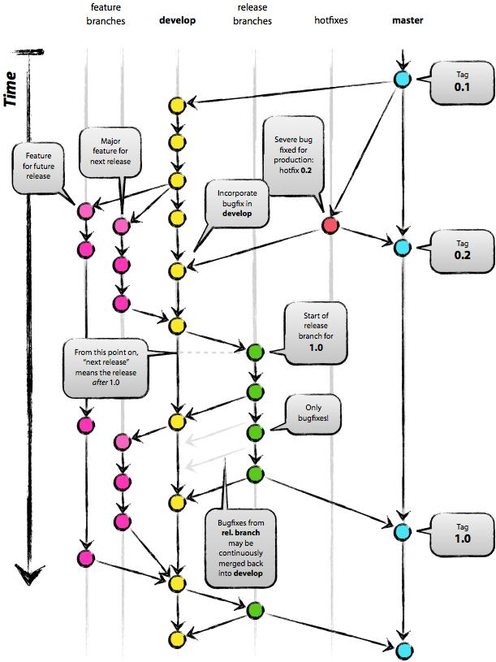

# 奇效后端代码开发规范


## 目录
1. [关键词解释](#1-关键词解释)
2. [命名规范](#2-命名规范)
3. [开发建议](#3-开发建议)
4. [逻辑分层规范](#4-逻辑分层规范)
    1. [Model层规范](#41-Model层规范)
    2. [Service层规范](#42-Service层规范)
    3. [Controller层规范](#43-Controller层规范)
    4. [Library规范](#44-Library规范)
5. [数据库规范](#5-数据库规范)
    1. [建表规范](#51-建表规范)
    2. [索引规范](#52-索引规范)
    3. [SQL语法规范](#53-SQL语法规范)
6. [GIT规范](#6-GIT规范)
7. [扩展阅读](#7-扩展阅读)


## 1. 关键词解释
本规范中出现的措辞解释如下:
* **强制（must， required, shall）**: 强制执行，必须怎么做。
* **禁止（must not, shall not）**: 强制执行，不能怎么做。
* **推荐（required， recommended）**: 存在某些特殊情况下有合理的理由可以不强制执行部分规定。
* **不推荐（shall not， not recommended）**: 存在某些特殊环境下有合理的理由，部分禁止的规定可以执行。
* **可选（may，optional）**: 真的可选。


## 2. 命名规范
使用ThinkPHP开发的过程中应该尽量遵循下列命名规范: 

* **【强制】** 类文件都是以`.class.php`为后缀（这里是指的ThinkPHP内部使用的类库文件，不代表外部加载的类库文件），使用驼峰法命名，并且首字母大写，例如 `DbMysql.class.php`；
* **【强制】** 类的命名空间地址和所在的路径地址一致，例如 `Home\Controller\UserController`类所在的路径应该是 `Application/Home/Controller/UserController.class.php`；
* **【强制】** 确保文件的命名和调用大小写一致，是由于在类Unix系统上面，对大小写是敏感的（而ThinkPHP在调试模式下面，即使在Windows平台也会严格检查大小写）；
* **【强制】** 类名和文件名一致（包括上面说的大小写一致），例如 `UserController`类的文件命名是`UserController.class.php`， `InfoModel`类的文件名是`InfoModel.class.php`， 并且不同的类库的类命名有一定的规范；
* **【强制】** 以双下划线“__”打头的函数或方法作为魔法方法，例如 `__call` 和 `__autoload`； 
* **【推荐】** 函数、配置文件等其他类库文件之外的一般是以`.php`为后缀（第三方引入的不做要求）；
* **【推荐】** 函数的命名使用小写字母和下划线的方式，例如 `get_client_ip`；
* **【推荐】** 方法的命名使用驼峰法，并且首字母小写或者使用下划线“_”，例如 `getUserName`，`_parseType`，通常下划线开头的方法属于私有方法；
* **【推荐】** 属性的命名使用驼峰法，并且首字母小写或者使用下划线“_”，例如 `tableName`、`_instance`，通常下划线开头的属性属于私有属性；
* **【推荐】** 常量以大写字母和下划线命名，例如 `HAS_ONE`和 `MANY_TO_MANY`；
* **【推荐】** 配置参数以大写字母和下划线命名，例如`HTML_CACHE_ON`；
* **【推荐】** 语言变量以大写字母和下划线命名，例如`MY_LANG`，以下划线打头的语言变量通常用于系统语言变量，例如 `_CLASS_NOT_EXIST_`；
* **【推荐】** 数据表和字段采用小写加下划线方式命名，并注意字段名不要以下划线开头，例如`think_user`表和`user_name`字段是正确写法，类似`_username`这样的数据表字段可能会被过滤。


## 3. 开发建议
在使用ThinkPHP进行开发的过程中，我们给出如下建议，会让你的开发变得更轻松: 

* **【推荐】** 遵循框架的命名规范和目录规范；
* **【推荐】** 开发过程中尽量开启调试模式，及早发现问题；
* **【推荐】** 多看看日志文件，查找隐患问题；
* **【推荐】** 养成使用`I`函数获取输入变量的好习惯；
* **【推荐】** 更新或者环境改变后遇到问题首要问题是清空Runtime目录；


## 4. 逻辑分层规范
对于仅用作提供http接口的后端项目来说，应用的逻辑拆分为Controller，Service和Model三层


### 4.1. Model层规范
* **【强制】** Model对应具体的、无业务逻辑的数据操作，即每个Model对应一个资源实体的增删改查操作
* **【强制】** Model层禁止同层调用，只能访问具体数据，不能调用其他Model
* **【强制】** 访问数据库的Model必须使用ThinkPHP的`Model`类中封装的方法，不得自己拼接SQL操作
* **【强制】** Model应规范命名：`WorknoteFileModel`，对应文件的文件名是`WorknoteFileModel.class.php`
* **【强制】** Model不可暴露底层交互协议信息，比如直接把sql信息返回给上层
* **【推荐】** 一个Model只能访问一个资源，如一个数据表或者一个文件
* **【推荐】** Model层尽量不要进行联表查询，如果有多个表联合取数据的需求，在上层做数据连接
* **【推荐】** 名称与对应资源使用固定的映射方式，即驼峰命名的类映射为下划线分隔的表名，然后再加上固定前缀，比如`WorknoteFileModel`类对应`tb_worknote_file`表(假设前缀为`tb_`)
* **【推荐】** 如有选项类参数，需以常量暴露给上层，不可出现magic number， 比如需求的状态信息不可直接返回数字，而是要返回数字对应的常量
* **【推荐】** 对于数据表访问的Model，其接口可以固定为对具体的数据表的增删改查4类接口，建议提供如下固定接口：
  1. `add($arrFields)`: 新增一条记录，参数为`key=>value`键值对(`insert`已被`\Think\Model`占用)
  2. `remove($id)`: 根据主键id删除一条记录(`delete`已被`\Think\Model`占用)
  3. `modify($id, $arrFields)`: 根据主键id修改一条记录(`update`已被`\Think\Model`占用)
  4. `get($id)`: 根据主键id查询一条记录
  5. `getList($where)`: 根据查询条件获取一组记录
  6. 其他复杂的查询操作单独增加接口，比如`group by`

### 4.2. Service层规范
* **【强制】** Service主要是在Model层的基础上提供一个相对细粒度的接口封装，或者提供原子功能的接口封装，具体来说可有以下几种
  1. 具体数据表(Model)和cache的数据组合、拼装；
  2. 逻辑上的原子操作；
  3. 可被多个业务逻辑复用的相对细粒度接口
* **【强制】** Service应规范命名: `WorknoteService`，对应文件为`Auth/Service/WorknoteService.class.php`(`Auth`为模块名)
* **【强制】** Service不可调用非自己主题的Model
* **【推荐】** Service应该保持职责单一，按主题提供数据操作服务给Controller和其他Service使用
* **【推荐】** Service可以调用另外一个Service，但是不可互相依赖，形成环路

### 4.3. Controller层规范
* **【强制】** Controller层主要通过组合Service提供的功能来做一个具体请求相关的业务逻辑处理。其工作主要有以下几种：
  1. 参数解析
  2. 错误处理
  3. 返回格式转换
  4. 组合Service功能
  5. 数据校验
  6. 安全校验
* **【强制】** 一个URL严格对应一个Action
* **【强制】** Controller通过设置`ACTION_BIND_CLASS => true`将action从方法绑定到类上
* **【强制】** Controller应规范命名, 比如请求路径为`auth/worknote/getlist`，那对应的类名应为`GetList`(首字母大写驼峰命名)，对应的文件为`Auth/Controller/getlist.class.php`(注意文件名需要全小写)
* **【强制】** Controller在基类`run()`中完成调用`execute()`方法(抽象方法)、进行错误处理和返回格式转换
  * 每个子类需继承基类并在`execute()`中实现具体业务逻辑
  * 需要用`try { ... } catch (\Exception $e) {}`包裹`execute()`调用，统一进行错误处理
  * 接口返回值为固定为json格式`json_encode(['code'=>0,'msg'=>'数据库连接异常', 'data'=>$data])`, 其中`code`为错误码，`msg`为错误信息, `data`为接口返回的业务数据
* **【强制】** Controller禁止同层调用

### 4.4. Library规范
* **【强制】** APP内部通用的与具体业务无关的算法实现或者工具类需要放在本地`ThinkPHP/Libray`目录下。每个APP可以提供多个Library
* **【强制】** 模块内部类库放在模块根目录下，命名空间路径需与文件实际路径一致，比如`Common\Util\Pay`类,位于`Application\Common\Util`
* **【强制】** Library不得依赖Controller、Service和Model


## 5. 数据库规范

### 5.1. 建表规范
* **【强制】** 表达是与否概念的字段，必须使用`is_xxx`的方式命名，数据类型是`unsigned tinyint`（1表示是，0表示否）
* **【强制】** 表名、字段名必须使用小写字母或数字，禁止出现数字开头、两个下划线中间只出现数字
* **【强制】** 表名不使用复数名词
* **【强制】** 禁用保留字，如`desc`、`range`、`match`、`delayed`等, 详细参考: [mysql保留字](https://dev.mysql.com/doc/mysqld-version-reference/en/mysqld-version-reference-keywords-5-7.html)
* **【强制】** 小数类型为`decimal`，禁止使用`float`和`double`
* **【强制】** 如果存储的字符串长度几乎一样，使用`char`定长字符串
* **【强制】** 字符集使用`utf8`, 校正规则使用`utf8_general_ci`
* **【强制】** 每个字段必须使用`comment`添加注释信息
* **【推荐】** `varchar`是可变长字符串，不预先分配存储空间，长度不要超过5000。如果存储长度大于此致，定义字段类型为`text`，独立出来一张表，用主键对应，避免印象其他字段的索引效率
* **【推荐】** 表的命名最好是"固定前缀_业务名称_表的作用", 比如`tb_worknote_file`
* **【推荐】** 库名与应用名尽量一致
* **【推荐】** 字段允许适当冗余，以提高查询性能，但必须考虑数据一致性。冗余字段应遵循：
  1. 修改不频繁
  2. 非`varchar`, 更非`text`
* **【推荐】** 单表超过500万行或容量超过2GB时，才推荐进行分库分表
* **【推荐】** 合适的字符存储长度，不但节约数据库空间、节约索引存储，更重要的是提升检索速度

### 5.2. 索引规范
* **【强制】** 业务上具有唯一特性的字段，即使是多个字段的组合，也必须建成唯一索引
* **【强制】** 超过三个表禁止`join`。需要`join`的字段，数据类型必须绝对一致，并有索引
* **【强制】** `varchar`上建立索引时必须指定索引长度
* **【强制】** 页面搜索严禁左模糊或者全模糊，如果需要请走搜索引擎来解决
* **【推荐】** 如果有`order by`的场景，请注意利用索引的有序性
* **【推荐】** 利用覆盖索引来进行查询操作，避免回表
* **【推荐】** 利用延迟关联或者子查询优化超多分页场景
  ```sql
  -- 误
  SELECT * FROM 表1 WHERE 条件 LIMIT 100000, 20
  -- 正
  SELECT a.* FROM 表1 a, (SELECT id FROM 表1 WHERE 条件 LIMIT 100000,20 ) b WHERE a.id=b.id
  ```
* **【推荐】** SQL性能优化的目标：至少要达到range级别，要求是ref级别，如果可以是consts最好
  1. range: 对索引进行范围检索
  2. ref: 使用普通索引(`normal index`)
  3. consts: 单表中最多只有一个匹配行
* **【推荐】** 建组合索引的时候，区分度最高的在最左边
* **【推荐】** 防止因字段类型不同造成的隐式转换，导致索引失效
* **【推荐】** 创建索引时避免有如下极端误解：
  1. 宁滥勿缺：认为一个查询就要建一个索引
  2. 宁缺毋滥：认为索引会消耗空间、严重拖慢更新和新增速度
  3. 抵制唯一索引：认为业务的唯一性一律需要在应用层通过"先查后插"的方式解决

### 5.3. SQL语法规范
* **【强制】** 不要使用`count(列名)`或`count(常量)`来代替`count(*)`
* **【强制】** 当某一列值全为`NULL`时，`count(col)`返回为`0`，`sum(col)`返回为`NULL`
* **【强制】** 使用`ISNULL()`来判断是否为`NULL`值
* **【强制】** 在代码中写分页查询逻辑时，若`count`为`0`应直接返回，避免执行后面的分页语句
* **【强制】** 禁止使用存储过程，存储过程难以调试和扩展，更没有移植性
* **【推荐】** 数据订正(特别是删除、修改记录操作)时，要先`select`，避免出现误删，确认无误后才能执行更新语句
* **【推荐】** 不得使用外键与级联，一切外键概念必须在应用层解决
* **【推荐】** 尽量避免`in`操作，如果无法避免，则控制在1000个以内
* **【推荐】** `select`使用明确的字段名代替`*`


## 6. GIT规范
推荐参考以下git流程：



* **【强制】** 不要从公用环境中提交代码，环境只能从远程拉取最新代码
* **【强制】** 线上分支为`master`，开发分支为`develop`，测试分支为`test`，线上bug验证分支`hotfix`, 线上bug修复分支为`hotfix-*`
* **【强制】** 简单开发在`develop`上进行，较大工作量的可从`develop`拉出特性分支`feature-*`开发。完成后合并至`develop`, 并删除特性分支
* **【强制】** 开发完成后需要提测，此时将`develop`代码合并至`test`，并更新测试环境。
  * 如果`develop`中多版本同时存在，但仅其中一版需要提测，则可仅合并对应特性分支至`test`即可
  * 注意此时如果存在未合并至`test`环境的`hotfix-*`，需要手动合并过去
* **【强制】** `test`分支仅供修复测试发现bug之用，不做新功能开发。测试完成后合并至`develop`和`master`，然后进行上线
* **【强制】** 线上bug修复：从`master`拉取`hotfix-*`分支进行修复，修复完成合并至`hotfix`分支并在预发布环境进行验证，验证无误后将`hotfix-*`后合并至`develop`和`master`分支，然后删除修复分支
* **【强制】** `master`上线前需要打上对应版本的tag
* **【推荐】** 用完的特性/修复分支，请及时删除，并提前周知相关人员(如果有)
* **【推荐】** 本地提交及时推送到远程，以免多人协作时出现大规模冲突


## 7. 扩展阅读: 
1. [Key words for use in RFCs to Indicate Requirement Levels](https://tools.ietf.org/html/rfc2119)
2. [ThinkPHP 3.2.3完全开发手册](https://www.kancloud.cn/manual/thinkphp/1678)
3. [PHP 标准规范](https://psr.phphub.org/)
4. [阿里JAVA开发规范](https://github.com/alibaba/p3c/blob/master/%E9%98%BF%E9%87%8C%E5%B7%B4%E5%B7%B4Java%E5%BC%80%E5%8F%91%E6%89%8B%E5%86%8C%EF%BC%88%E8%AF%A6%E5%B0%BD%E7%89%88%EF%BC%89.pdf)
5. [GIT分支管理是一门艺术](https://kb.cnblogs.com/page/132209/)
6. [Growth: 全栈增长工程师指南](https://github.com/phodal/growth-ebook)