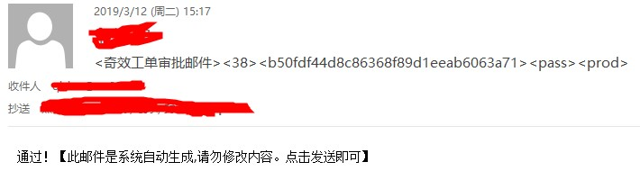
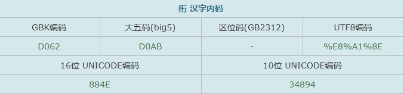
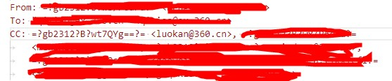

# 邮件审批失败BUG原因排查

## 背景
奇效支持邮件审批功能，用户申请会发送审批邮件给相关人员，其可通过发送审批邮件的方式完成审批。审批邮件如下所示：



奇效会定时查询该邮箱，解析其中的信息完成审批操作

## 问题
某天发现审批邮件发送后，系统没有执行对应的操作。排查发现定时任务执行完成后，对应的邮件并没有被处理，且对应的审批单没有被处理

## 排查步骤
1. 查看日志，发现解析的邮件header是null，故没有后续处理就返回了
2. 解析语句存在报错，如下：
    ```php
    $headerDecoded = iconv_mime_decode_headers($headerRaw, 0, 'UTF-8');
    // Notice: iconv_mime_decode_headers(): Detected an illegal character in input string in D:\Program\www\qixiao\test.php on line 65
    ```
3. 设置忽略错误字符后可以正常输出，此时发现存在无法解析的字符，如下：
    ```php
    $headerDecoded = iconv_mime_decode_headers($headerRaw, 0, 'UTF-8//IGNORE');
    // 乱码为：       罗b <luokan@360.cn>
    // 正确字符应为： 罗衎 <luokan@360.cn>
    ```
4. 查询“衎”子中文编码如下，gb2312中“衎”字无对应编码，而读取的邮件抄送人正是用gb2312编码，如下所示
    
    
    
    这样会导致解码时出现非法字符
5. 审批邮件是使用mailto生成的邮件，该邮件默认使用邮件客户端的编码（默认gb2312，原因在这里）

## 解决方案
1. 目前在iconv_mime_decode_headers()编码方式上指定IGNORE可以忽略这个问题（因为审批用不到收件人信息）
2. 完美方案应该是让mailto生成的邮件使用utf8编码，这里暂时还没查到解决方案