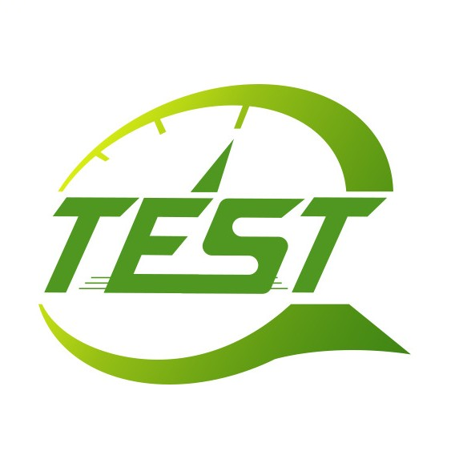
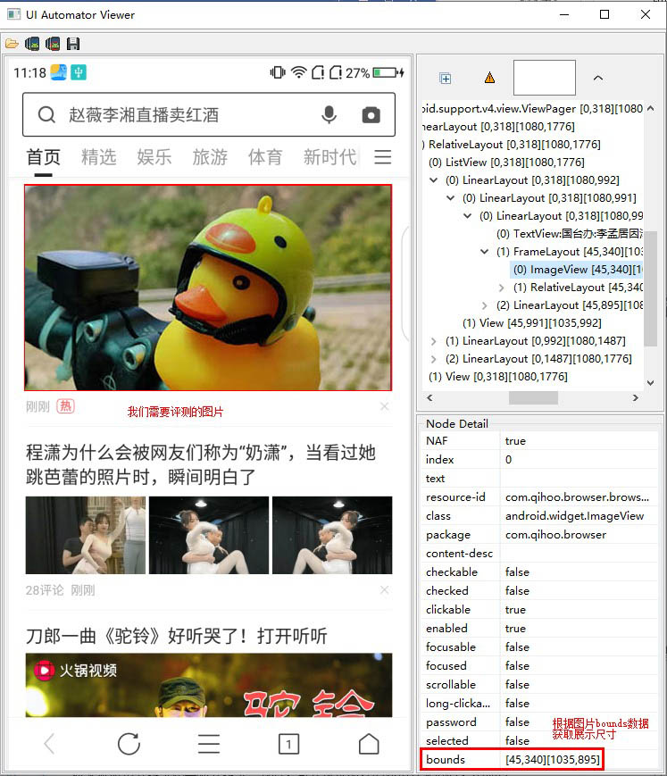
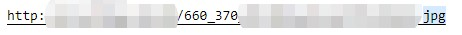
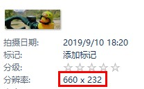
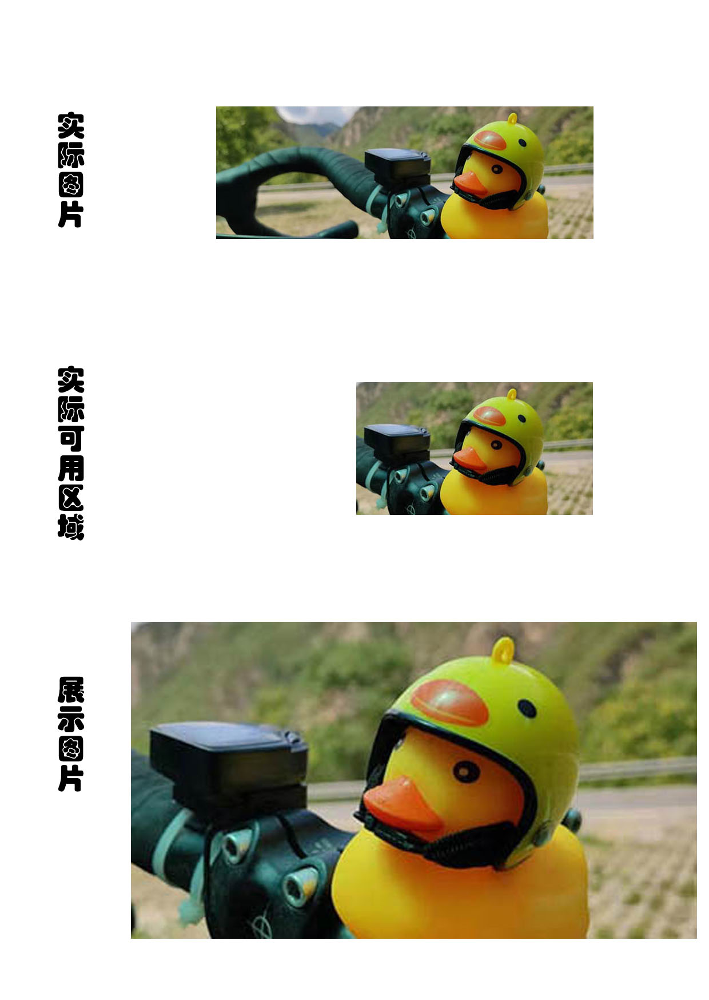
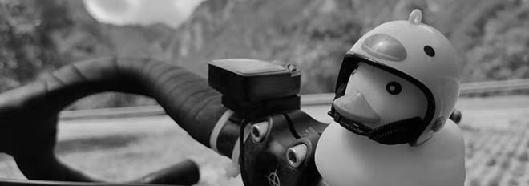
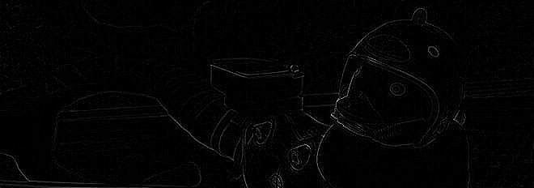
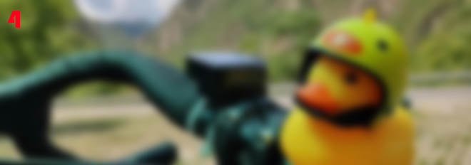
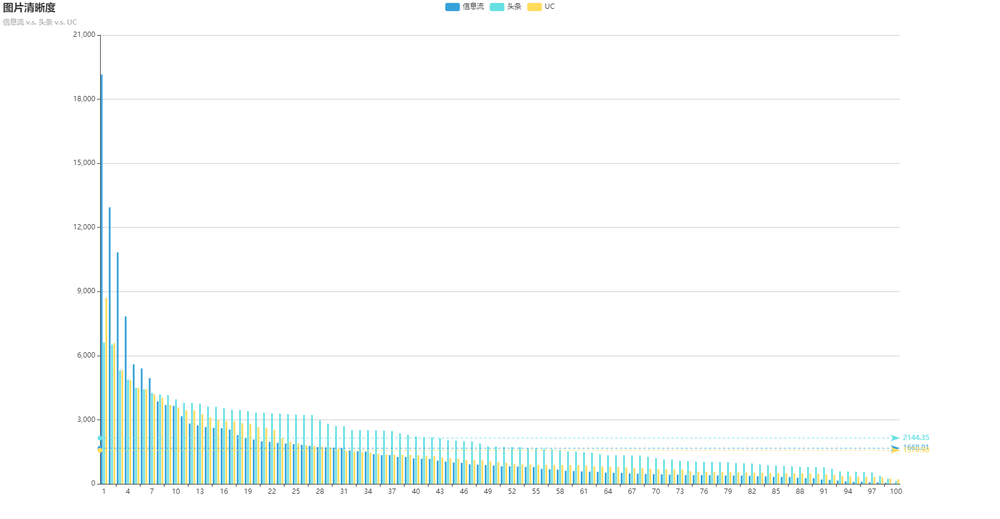

# 图片质量测试

最近笔者测试工作中，需要测试360手机浏览器中信息流中图片质量并与竞品进行对比分析，然而其实并未该测试经验，一番调研之后决定选用缩放比和清晰度这两个指标来衡量图片质量，在此把调研结果分享给大家。

## 图片存储方式
<!-- 说明一下图片的两种形式：位图和矢量图，有何不同 -->
在正式开始测试之前，先介绍一点基础知识，即图片的两种主要存储形式：矢量图和位图。

矢量图是由一系列数学公式定义的点、线和颜色组成图形，特点是放大后不会失真，只能表示简单、有规律的图形，多用于文字、图标和版式设计，如下：



位图是由若干像素点构成的图形，特点是只要有足够多不同色彩的像素，就能够显示出色彩细腻丰富的图像，真实还原现实世界，占用体积较大、缩放存在模糊的情况。

假如我们将上图转换为位图，然后调低分辨率，就能看到明显的像素点，如下：


<!-- 信息流展示图片绝大多数都是位图 -->
现在的网络新闻中图片绝大多数用的都是位图，而且矢量图并不存在清晰度的问题，所以接下来的衡量图片清晰度问题主要是针对位图展开


## 图片清晰度衡量方式
<!-- 位图、像素、分辨率和清晰度的关系 -->
位图由一个个像素构成，像素点横向和纵向的数量称为分辨率。一般情况下分辨率越大的图像越清晰，但并不绝对，比如将分辨率本身就很小的图片强行调高分辨率并不会让图片更清晰，只不过是增加了冗余像素点，同时也增大了图片体积，因为位图存储的实际上是每个像素点的信息。

对于一张无冗余像素的图片来说，最好的展示情况就是图片的展示分辨率和实际分辨率一致，即设备上的像素点与图片的像素点一一对应。

此时图片分辨率的提示并不会带来视觉效果的提升，但是体积却更大；而图片分辨率下降会导致视觉效果的相应下降。

实际中，不同手机设备的分辨率多种多样，以及对网络流量成本的考虑，图片分辨率一般会取一个比展示分辨率小一些的值，来达到视觉效果和流量成本的平衡。也就是说图片存在一定缩放。

由此，我们可以引出衡量图片清晰度的两个指标：
1. 缩放比
2. 清晰度

## 缩放比测试
首先说明下缩放比的计算方式：
```
缩放比 = 图片实际宽度 / 图片展示宽度 * 100%
或
缩放比 = 图片实际高度 / 图片展示高度 * 100%
```
为了保证图片不失真，缩放时均使用等比缩放，所以使用宽度或高度计算均可。由公式可以看出，值越小图越不清晰。

<!-- 使用uiautomatorviewer查看图片实际的展示大小 -->
我们使用现在常见的高分屏手机（`1080*1920`）打开360手机浏览器，然后使用uiautomatorviewer获取页面结构信息，如下所示：



其中bounds信息为控件左上角和右下角的坐标，据此我们可以计算出展示尺寸为`(1035-45)*(895-340)=990*555`

然后我们查看图片请求，发现请求的图片尺寸为`660*370`，可以得出设计中的缩放比为`66.67%`，如下所示：



注意此时出现第一次缩放

再然后我们查看返回图片尺寸为`660*232`



可以看出实际高度232小于请求高度370，而app为了填充整个区域只好进行第二次缩放，实际用到的图片区域为`414*232`, 此时缩放比为`42%`

因图片尺寸配置不当的原因，即使原图比较清晰，放大之后也会模糊，整体过程示例如下：



修复方案为调整图片尺寸、使高度满足请求，可以将图片缩放比由`41.8%`提高至设计的`66.67%`。


## 清晰度测试
除了缩放的问题外，图片本身的清晰度也会影响最终展示效果。衡量图片清晰度的方式多种多样，本文选用了一种可以产出单一数值的方式来计算清晰度，即将图片褪色为灰度图，然后通过拉普拉斯掩模做卷积运算，计算标准差作为图片清晰度。方差越大可认为是边缘越多，也就是聚焦准确、图像清晰；反之方差越小，则认为边缘越少，图片越模糊。

<!-- （此处需要原图，灰度图） -->
计算过程举例如下，假如我们有一张原图：


首先我们计算它的灰度值，如下所示：



然后计算边缘，如下所示：



最后使用边缘数据计算标准差得出清晰度数值为186


为了对比效果，我们使用模糊后的图片计算清晰度，结果为4



此时我们就可以用数值的高低来简单地判断图片的清晰程度

整个过程的图像处理用的是opencv的python封装库`cv2`，可以直接使用`pip install opencv-python`安装

计算清晰度代码也非常简单，只有不到10行：
```python
# coding: utf8
import cv2

def get_image_shapeness(image_path):
    # 读取图片
    image = cv2.imread(image_path)
    # 褪色
    image_grey = cv2.cvtColor(image, cv2.COLOR_BGR2GRAY)
    # 边缘检测
    image_shape = cv2.Laplacian(image_grey, cv2.CV_64F)
    # 计算清晰度
    return image_shape.var()
```

说明完清晰度计算方式后，下面我们开始竞品对比，此处对比各方分别为：360手机浏览器信息流、今日头条和UC浏览器信息流，我们从流中各抓取100张图片，计算其清晰度并统计结果，如下所示:



从上图可以看出360浏览器信息流和UC信息流的图片清晰度均值基本一致，而头条的清晰度均值明显要高一些。但是因为抓取的图片并不相同，其本身就给结果引入一定的随机性，故此值仅供参考，具体情况要结合自己业务实际分析。这里主要是提供一个衡量清晰度的思路。


## 结论
1. 一般来说，展示分辨率和实际分辨率一致时，即可保证在显示效果最佳的同时，不存在体积浪费，但实际中为了视觉效果和流量成本一般会取一个折中值；
2. 使用边缘检测算法计算清晰度值可以做为参考，但因为图片本身的随机性，统计结果并不绝对，此处主要是提供一个思路。理论上样本数量越大越能消除图片本身随机性的影响。