# 软件测试的误区
>译者注：  
原文链接"http://blog.codepipes.com/testing/software-testing-antipatterns.html"  
作者[Kostis Kapelonis](http://codepipes.com/contact.html)(版权所有)

## 简介
有很多文章探讨过软件开发过程中的测试误区。但大多着眼于底层编码细节，而且总是着眼特定的技术或编码语言。

本文我会后退一步，从更高层次上总结出一些语言无关的测试误区。希望无论你偏好什么语言，都能从本文学习到有用的东西。

## 术语
不幸地是，测试术语并未达成共识。关于集成测试、模块测试和端到端测试的区别，100个测试人员可能会有100种不同的答案。为了更好地说明测试误区，我会重点关注如下所示的测试金字塔的定义。

如果你没听说过测试金字塔，最好在阅读本文之前了解一下。推荐文章：
* [The forgotten layer of the test automation pyramid](https://www.mountaingoatsoftware.com/blog/the-forgotten-layer-of-the-test-automation-pyramid) (Mike Cohn 2009)
* [The Test Pyramid](https://martinfowler.com/bliki/TestPyramid.html) (Martin Fowler 2012)
* [Google Testing blog](https://testing.googleblog.com/2015/04/just-say-no-to-more-end-to-end-tests.html) (Google 2015)
* [The Practical Test Pyramid](https://martinfowler.com/articles/practical-test-pyramid.html) (Ham Vocke 2018)

测试金字塔本身就值得讨论，特别是关于每一层所需的测试量。本文引用金字塔只是为了定义底层的两种测试类型。注意，本文中 _并未_ 提及UI测试(位于顶层)(为了简化起见，而且UI测试的误区会单独说明)。

上面提到的两种主要测试类型，单元测试和集成测试，定义如下：

|测试类型|关注点   |依赖       |速度  |复杂度|是否需要安装|
|-------|---------|----------|------|-----|-----------|
|单元测试|类/方法  |源代码     |非常快|低    |否         |
|集成测试|模块/服务|部分运行系统|慢    |中    |是        |

**单元测试** 顾名思义，是一种广泛应用的测试类型。其与源码放在一起并可直接访问源码。通常由[xUnit框架](https://en.wikipedia.org/wiki/XUnit)或其他类似的库执行。测试直接运行在源码上，能够有一个全局的视角。测试一个单独的类/方法/函数（或某业务功能的最小工作单元），其他的都用stub/mock。

**集成测试** (也叫服务测试，或者模块测试)关于整个模块。一个模块可以是一个包含若干类/方法/函数的集合、模块、子系统或甚至应用本身。其通过传递输入数据并检查输出数据来校验模块。通常需要先进行某些部署/启动/安装。外部系统可以完全模拟、替换(比如使用内存数据库替换实际数据库)、或者根据业务状况决定是否使用真实的外部依赖。相比于单元测试，集成测试需要用更专业的工具来准备测试环境或者交互/验证系统。

第二种测试类型定义五花八门，关于测试命名的争议也是繁多。而且集成测试的“范围”也是颇具争议，尤其涉及到其访问应用的本质（是黑盒还是白盒测试以及是否允许mock）

有一些经验法则可以帮助判断测试类型。如果：
* 测试使用了数据库
* 测试通过网络调用了其他模块/应用
* 测试使用了外部系统（比如队列，或者邮件服务器）
* 测试进行了文件读写或者其他IO操作
* 测试并不依赖源码而是依赖部署好的app的二进制文件

那么该测试就是集成测试而不是单元测试。

说完命名的问题，我们可以深入测试误区列表了。测试误区的顺序大概按照其出现的频率排序。经常出现的会排在前面。

## 软件测试误区列表
1. [只有单元测试，没有集成测试](#误区1-只有单元测试没有集成测试)
2. [只有集成测试，没有单元测试](#误区2-只有集成测试没有单元测试)
3. [测试种类错误](#误区3-测试种类错误)
4. [测试错误的功能](#误区4-测试错误的功能)
5. [测试内部实现](#误区5-测试内部实现)
6. [过于关注测试覆盖率](#误区6-过于关注测试覆盖率)
7. [存在不稳定或者耗时的测试](#误区7-存在不稳定或者耗时的测试)
8. [手动运行测试用例](#误区8-手动运行测试用例)
9. [把测试代码当做二等公民](#误区9-把测试代码当做二等公民)
10. [没有把产品bug转化测试用例](#误区10-没有把产品bug转化测试用例)
11. [拿TDD当做信仰](#误区11-拿TDD当做信仰)
12. [不看说明书直接写测试用例](#误区12-不看说明书直接写测试用例)
13. [因为无知而认为测试不好](#误区13-因为无知而认为测试不好)

## 误区1: 只有单元测试，没有集成测试
这是中小型企业中经常存在的问题。公司开发的应用除了单元测试（测试金字塔最底层）外啥也没有。通常缺少集成测试的原因是下面几种：
1. 公司没有高级开发人员。团队中只有刚毕业的初级开发人员，基本只见过单元测试。
2. 曾经采用过集成测试，但是又废弃了，因为带来的麻烦比收益要多。单元测试好维护，所以占了上风。
3. 设置应用的运行环境非常具有“挑战性”。在产品中“测试”功能。

对于第1条真的没啥好说的。每一个高效的团队都至少有一些能够向其他人传授良好实践的导师。第2条会在误区[5](#误区5-测试内部实现)、[7](#误区7-存在不稳定或者耗时的测试)、[8](#误区8-手动运行测试用例)中详述。

然后看下最后一个问题：难以设置测试环境。不要误会，有的应用确实难以测试。我曾经遇到过一组REST应用，所在主机实际上依赖一种特殊的硬件。而该硬件只存在于生产环境，所以进行集成测试非常有挑战性。但这只是一个极端情况。

对于公司编写的一般web或后端应用来说，测试环境设置应该是没有问题的。随着虚拟机和最近容器技术的兴起，这一点更加毋庸置疑。如果准备测试的应用很难设置测试环境，那你首先要做的是修正设置过程而不是开始测试。

但是为什么集成测试是必须的呢？

原因是有一些问题只能由集成测试检测出来。典型的例子是所有同数据库操作相关的东西。比如数据库事务，数据库触发器和其他只有集成测试才会访问到的存储过程。无论是你还是其他团队开发的模块间的连接需要集成测试(也叫契约测试)。任何需要验证性能的测试，从定义上来说都是集成测试。下面是需要集成测试的理由：

|问题类型|单元测试可检验|集成测试可检验|
|-------|-------------|-------------|
|基本业务逻辑|是 |是|
|模块集成问题|否 |是|
|事务|否 |是|
|数据库触发器/过程|否 |是|
|与其他模块/API之间的契约错误|否 |是|
|与其他系统之间的契约错误|否 |是|
|性能/超时|否 |是|
|死锁/活锁|也许 |是|
|横切安全关注点|否 |是|

基本上，应用中任何存在横切关注点的地方都需要集成测试。随着近期微服务架构的火爆，集成测试变得更加重要，因为即使你自己的服务之间也需要按照契约进行交互。如果这些服务由其他团队开发，你需要自动化的方式来校验接口契约是否有效。而这些只能由集成测试完成覆盖。

总结，除非你开发的模块极度独立(比如linux命令行工具)，否则你真的**需要**集成测试来找出单元测试无法发现的bug。

## 误区2: 只有集成测试，没有单元测试
这与上一个误区相反。这个误区在大公司和大项目中更常见。几乎所有情况背后都与开发人员认为单元测试没有价值，只有集成测试才能发现问题的看法有关。相当多经验丰富的开发人员认为单元测试是在浪费时间。如果和他们深入交流之后，通常你会发现在过去，高层曾强制他们通过编写琐碎的单元测试来提高测试覆盖率。

理论上你 _可以_ 在软件项目中仅采用集成测试。但实际上这会使测试代价变高(开发时间和构建时间)。在上一节的表中，我们知道集成测试同样可以用于发现逻辑错误，所以集成测试就可以用该方式"取代"单元测试。但是这种方式是长期可行的吗？

### 集成测试的复杂性
举个例子。假如你有一个服务，包含4个方法/类/函数。

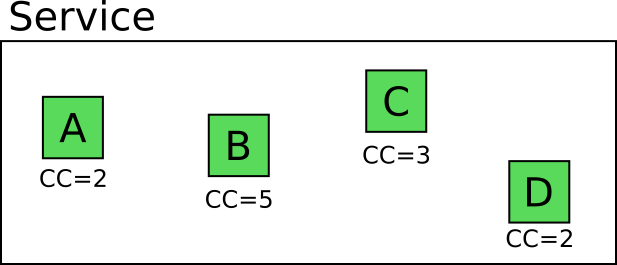

模块上数字表示[圈复杂度](https://en.wikipedia.org/wiki/Cyclomatic_complexity)，换句话说为其独立代码路径条数。

Mary，一个"理论派"研发，想要为服务编写单元测试(因为她认为单元测试 _确实_ 有价值)。那么为了覆盖所有可能的场景她需要写多少用例呢？

显然写`2+5+3+2=12`个独立的单元测试就可以完全覆盖这些模块的业务逻辑。记住这只是单独一个服务的数字，而Mary负责的应用包含很多服务。

Joe, 一个"暴躁派"研发，相反地，他从不认可单元测试的价值。他认为单元测试是在浪费时间，并且只在该模块中写集成测试。那么他需要写多少集成测试用例呢？他开始计算一个请求在该服务中所有可能的路径。

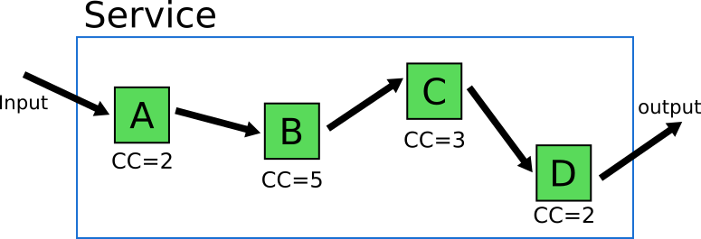

很明显，代码路径所有可能场景是`2*5*3*2=60`。那么这就意味着Joe真的会写60个集成测试用例吗？当然不是！他会偷懒。他会选出集成测试中一个感觉"有代表性"的子集。这个"有代表性"的子集可以让他通过最小的工作来达到足够的覆盖率。

理论上听起来很简单，但是很可能变得问题多多。实际情况是，这60个用例中的代码路径并不是平等的。其中有极端情况。比如，如果模块C中有3种不同的代码路径。其中一个是非常特殊的用例，只有C从B中得到一个特殊的输入时才会复现，而B只有从A中得到一个特殊的输入之后才会产生这种特殊输出。这意味着该特殊场景可能需要一个非常复杂的设置才能获取到可能触发这种极端情况的输入，以触发模块C的特殊条件。

而Mary，只需要用一个简单的单元测试用例即可复现该极端用例，不需要增加任何复杂度。

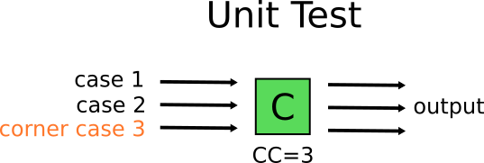

这意味着Mary可以 _只_ 给服务写单元测试吗？这样就变成了[误区1](#误区1-只有单元测试，没有集成测试). 为了避免这种情况，她两种都需要写。她应该完成所有的单元测试用例以覆盖业务逻辑，然后写1到2个集成测试用例用于保证系统的其他部分按照预期运行(也就是保证这些模块正常运行的东西)。

系统需要的集成测试应该关注其他模块。而内部业务逻辑应该交给单元测试。Mary的集成测试应该关注序列化/反序列化，队列通信和系统数据库交互的测试。

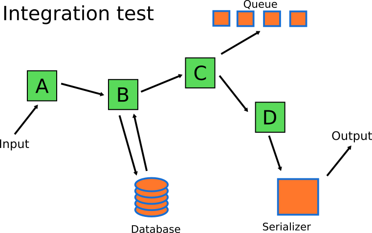

最后，集成测试的数量应该比单元测试的数量要少的多(符合测试金字塔的形状)

### 集成测试慢
抛开复杂性，集成测试的第二个大问题是速度。通常集成测试要比单元测试慢一个数量级。单元测试只需要应用源码。基本上是CPU密集型。而集成测试能够同外部系统进行IO操作，使得其很难高效运行。

让我们假设一组数据来获取一个运行时间差异的基本认知。
* 每个单元测试耗时60ms(平均)
* 每个集成测试耗时800ms(平均)
* 应用有40个像上一节中那样的服务
* Mary为每个服务写了10个单元测试用例和2个集成测试用例
* Joe为每个服务写了12个集成测试用例

现在我们来算一下。注意我这里假设了Joe已经找到了集成测试用例的最佳子集，让他能够得到和Mary一样的代码覆盖率(实际应用中是不可能的)

|运行时间|只有集成测试(Joe)|集成测试和单元测试(Mary)|
|--------|----------------|----------------------|
|仅单元测试|N/A            | 24s                  |
|仅集成测试|6.4m           | 64s                  |
|全部|     6.4m           | 1.4m                 |

总的运行时间相差巨大。每次代码变更后运行1分钟和6分钟的差异相当大。集成测试800ms的运行时间已经是相当保守了。我见过集成测试用例集中单个用例耗时达数分钟之久的。

总的来说，尝试只用集成测试来覆盖业务逻辑是非常耗时的。即使你用CI来自动化运行测试用例，反馈循环(从提交到获取测试结果的时间)也会非常长。

### 集成测试更难debug
最后一个关于为什么只用集成测试(没有任何单元测试)的原因是调试失败用例的会更耗时。因为集成测试是测试多个软件模块(根据定义), 当用例失败时，失败可能来自于任一个被测模块。定位问题的难度会随着模块数量的增加而增加。

当一组集成测试用例失败时，你需要能够知道失败原因并修复。集成测试的复杂度和广度使得其极难debug。我们再一次假设，你的应用只有集成测试。而你正在开发的应用是一个典型的电商网站。

团队中的研发人员(或者你)提交一次新的代码，触发集成测试，结果如下所示：

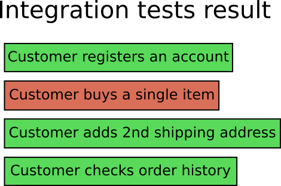

作为一个研发人员，你看着测试结果，发现名为"顾客买一个货物"的用例失败了。在电商应用这个上下文里，这句话并没有什么卵用。有很多种情况能导致这个用例失败。

除了深入日志和测试环境之外没有其他办法得知为什么用例失败原因。有些情况下(和更复杂的应用)唯一有效的debug方法就是检查代码，本地复现测试环境，然后运行集成测试用例，看看它在本地开发环境中如何失败。

现在想象你和Mary一起开发这个应用，所以你们有了单元测试和集成测试。你的团队提交了代码，运行所有测试之后得到如下结果：

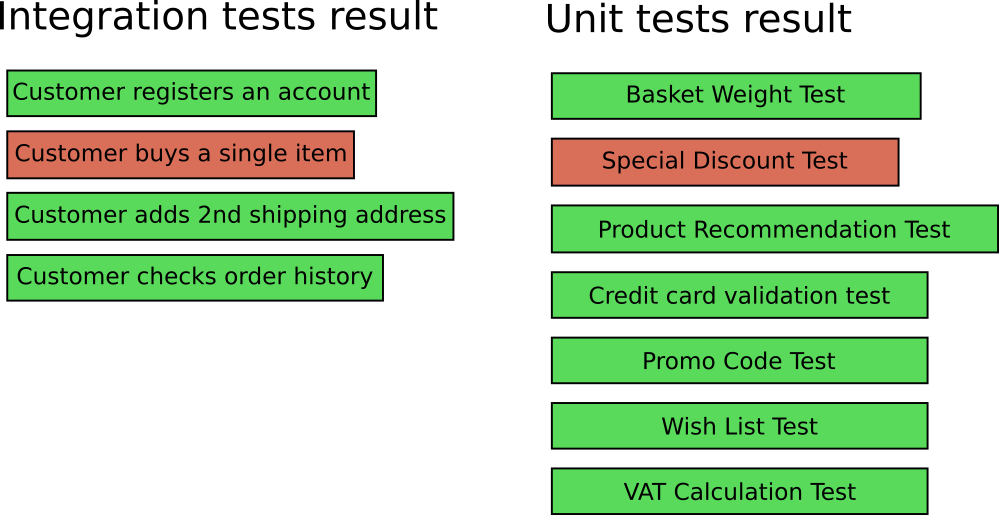

现在两套测试用例都失败了：
* "顾客买一个货物"像之前那样失败了(集成测试)
* "特殊折扣测试"同样失败了(单元测试)

现在就很容易知道应该从哪儿开始排查问题了。你可以直接查看 _Discount_ 功能的源码，定位bug并修复，99%的情况下集成测试中的bug也会随之修复。

在集成测试同时或之前出现单元测试失败，会让你的问题排查过程轻松许多。

### 快速总结你为什么需要单元测试
这是本文最长的一个章节，但是我认为很有必要。总的来说，理论上你可以只用集成测试，但实际上：
1. 单元测试更容易维护
2. 单元测试更容易复现极端用例和低频场景
3. 单元测试运行速度更快
4. 单元测试的失败比集成测试更容易修复

如果你只有集成测试，那么你是在浪费开发时间和公司成本。你需要同时准备单元和集成测试。他们并不互斥。网络很多文章宣扬仅采用一种测试类型。这些文章都被误导了。很遗憾但是真的。

## 误区3: 测试种类错误
既然我们知道了为什么同时需要多种测试类型(单元和集成)，现在我们需要决定每类中需要 _多少_ 测试用例。

没有快速可用的法则，这取决于你的应用。重要的是你需要花时间去理解哪种类型的测试对你的应用最有意义。测试金字塔对你测试用例数量仅仅是一个参考。它假设你写的是商业网站应用，但现实并非总是如此。我们来看一些例子：

### 例子： Linux命令行工具
假设应用是命令行工具。其读取一个特殊格式的文件(比如CSV)，一顿转换之后导出另一个格式(比如JSON)。应用是独立的，不与其他系统或者网络交互。转换是一个复杂的数学过程, 对应用的结果正确性要求严格(可以慢但是必须对)

在这个粗糙的例子中，你需要：
* 大量用于数学方程的单元测试
* 一些用于CSV读取和JSON写入的集成测试
* 没有GUI测试，因为没有GUI

那么这个项目的构成看起来是这样：

单元测试主宰了这个例子，而且形状完全就不是金字塔。

### 例子：支付管理系统
你正在开发一个新的项目，会被加入到现有的一个大型企业系统集合中去。该应用是一个支付网关，用于处理外部系统的支付信息。该系统需要将所有交易的信息记录至一个外部数据库，需要同外部支付供应商通信(比如 Paypal, Stripe, WorldPay)，需要也将交易细节发送给另一个发票系统。

在这个粗糙的例子中，你需要：
* 几乎不写单元测试，因为没有业务逻辑
* 大量的集成测试用于外部通信、数据存储和发票系统
* 没有UI测试，因为没有UI

那么这个项目的构成看起来是这样：

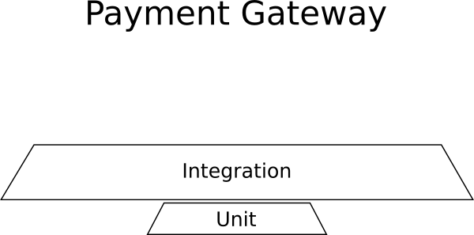

集成测试主宰了这个例子，而且形状完全就不是金字塔。

### 例子：网页生成器
你正在开发一个全新的项目，其会重新定义人们开发网站的方式，通过提供独一无二的方式在浏览器中完成创建网页应用。

应用是一个图形化设计页面，其中一个工具箱包含所有可能出现的HTML元素，并可随其它预定义模块一起添加至一个web页面中去。应用可以通过应用市场获取新的模板。网页生成器交互非常友好，允许你通过拖拽/放置元素，改变大小，编辑属性，变换颜色和外观。

在这个粗糙的例子中，你需要：
* 几乎没有单元测试因为没有业务逻辑
* 对接应用市场的集成测试
* 大量的UI测试用于保证用户体验就像广告中的一样

那么这个项目的构成看起来是这样：

UI测试主宰了这个例子，而且形状完全就不是金字塔。

我用了一些极端的例子说明为什么你需要理解你的应用并仅关注那些能够给你带来价值的测试类型。我曾经见过没有集成测试的"支付管理系统"和没有UI测试的"网页生成器"。

网上有些文章(我没打算po出链接)谈论一个你需要或不需要的集成/单元/UI测试的具体数字。所有的这些文章都建立在你的例子中不一定成立的假设之上。

## 误区4: 测试错误的功能
上面我们指出了测试类型和应用中需要的测试数量。下一步就是解释什么功能是你实际上需要测试的。

理论上，获取100%的测试覆盖率是终极目标。但实际上这个目标不仅很难达成，而且也无法保证系统没有bug。

有些场景确实有可能用测试覆盖应用的所有功能。如果你做的是个全新的项目，工作在一个行为规范的小团队并且已经考虑到测试所需的工作，那么为新功能添加新用例是极好的(因为老代码已经有了测试用例)。

但是并不是所有的开发者都这么幸运。大多数情况下你接手的项目只有最小限度的测试用例(甚至没有)。如果你在一个知名大公司工作，那么接手老代码基本就是现实而不是意外了。

理想情况下，你有充足的时间为新老代码编写测试用例。这种罗曼蒂克的想法大概率会被产品经理拒绝，因为他们只关心添加新功能而不是测试/重构老代码。你必须有的放矢，在在添加新功能(正如业务要求)和扩充已有的测试集之间找到平衡。

那么你要测什么？你应该从哪儿下手？我见过几次开发者浪费大量宝贵的时间来写"单元测试"，对应用的整体稳定性几乎没有价值。经典的无用测试就是琐碎的用以验证应用数据模型的例子。

代码覆盖率会在对应的章节分析。本节我们还是要讨论代码"紧急性"以及同你的测试之间的关系。

如果你让任意一个开发者给你看他的项目源码，他/她大概率会打开一个IDE或者代码仓库浏览器向你展示他的个人文件夹。

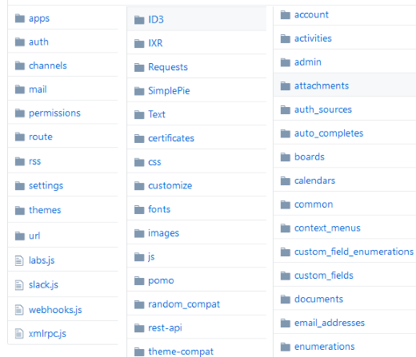

这是展示代码的物理结构。这定义了包含源码的文件系统中的文件。然而这种文件夹层级对于开发代码来说很好，但是并不能定义每个代码文件夹的重要性。一个扁平的代码文件夹列表暗示其中所有的代码模块的重要性相同。

事实上是错的，因为不同的代码模块对应用整体的功能性的影响是不同的。举个快例子，比如你正在写一个电子商店应用，现在产品中发现两个bug：
1. 顾客无法结账，进而中断了所有的销售
2. 顾客在浏览商品时收到了错误的推荐

即使所有的bug都应该被修复，但是很明显第一个优先级更高。因此如果你接手了一个没有测试用例的电商应用，你应该直接写用例校验结账功能，而不是推荐引擎。即使推荐引擎和结账过程的代码文件夹在文件系统中是平级的，在面临测试时的重要性还是不同的。

一般化这个例子，如果你在一个大中型项目中工作一段时间之后，你很快会需要使用一个不同的表现方式来思考这些代码 - 心智模型。

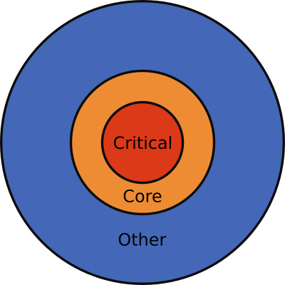

这里将代码分为三层，但是根据你项目的规模这个层级可能会更多。这些是：
1. 关键代码： 这是经常出错、包含最多功能以及对用户影响最大的代码
2. 核心代码：这是偶尔出错、包含若干功能以及对用户中等影响的代码
3. 其他代码：这是基本不变、很少有新功能记忆对用户基本无影响的代码

这个心智模型应该成为你无论在何时编写一个新的软件测试时应该记住的知道原则。扪心自问你现在编写测试用例对应的功能是否是关键代码或核心代码。如果是，那就继续。如果不是，那么你最好把开发时间花在其他地方(比如其他bug)。

将代码按照严重性分层的想法同样可以很好地回答那个老生常谈的问题：应用需要多高的代码覆盖率。要回答这个问题，你需要知道应用的严重性层级，或者问个知道的人。一旦你获取这个信息，那么答案就非常明确了：

**关键代码**要尽量达到100%代码覆盖率。如果已经完成，那么尽量让 **核心代码**达到100%覆盖率。达到全代码100%覆盖率是[不推荐的](#误区6-过于关注测试覆盖率)

一个需要注意的重要事情是，一个应用中关键代码总是很小的一部分。所以如果一个应用中关键代码达到总量的20%，那么20%的代码覆盖率就为生产环境缺陷数量的降低开了个好头。

总的来说，为具备如下特点的代码写单元和集成测试：
* 经常出错
* 经常变动
* 对业务很重要

如果你有充裕的时间丰富测试集，那么在你向没有价值的用例上浪费时间之前，确保你明白收益递减的概念。

## 误区5: 测试内部实现
测试总是越多越好，是吗？

错！你同样需要确保测试以正确的方式编写。使用错误的方式编写测试用例有两个坏处：
* 第一次编写时，浪费宝贵的部署时间
* 在需要重构时，浪费更多的时间（添加新功能时）

严格地说，[测试代码就像业务代码一样重要](#误区9-把测试代码当做二等公民)。你未来会需要重构代码以渐进地改进它。但是如果每次新增功能之后你都需要例行地修改测试代码以保证用例通过，那 _你的用例并没有测应该测的东西_。

我曾经见过公司在启动新项目时，认为他们应该正规一点，所以他们写了 _大量_ 的用例覆盖应用功能。不久之后，新增了一个功能，一些已有用例需要改动不然就无法通过。又新增一个功能，更多的用例需要变更。一段时间以后，每次花在重构/修复已有用例的时间就已经大大超过了编写新用例的时间。

这种情况下，有些开发者选择坦然接受。他们声称软件测试就是浪费时间并完全抛弃已有的测试代码好更多关注新功能。极端情况下，一些改动会因为大量的测试失败而无法进行下去。

这里的问题自然就是测试代码的糟糕质量。因为测试代码与主代码强耦合使得其不得不经常被重构。不幸的是，你需要一些基本测试经验来确定哪些测试的编写方式不正确。

添加新功能时不得不大量修改老用例表明 _病症_ 存在。问题在于测试验证了代码的内部实现，这里存在问题。网上有写文章尝试解释这一点，但是几乎没人能举出有效例子。

我在本章开头保证过不会使用特定的语言，我依旧打算信守承诺。本节里，想象一个你熟悉语言的数据结构。把他们当做包含了字段/值的结构/对象/类。

我们假设电商应用中顾客对象如下所示：

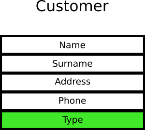

顾客对象的type字段有两个值，`0`代表"游客"，`1`代表"注册用户"。开发人员为这个对象写了10个用例验证游客、10个用例验证注册用户。这里所说的"验证"指的是测试会查看该特定对象的特定值。

时过境迁，业务决定为顾客类型增加一个值`2`代表附属企业。开发人员为附属企业增加了10个用例。最后又增加了"优质客户"，开发人员又加上了10个用例。

现在，这个字段上有4类共计40个用例(这些数字都是假设的。这个粗糙的例子只是为了说明目的。实际项目中可能会有6个嵌套对象中的10个互相关联的字段以及200个测试用例)

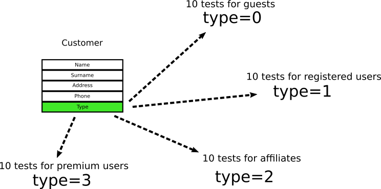

如果你是一个经验丰富的开发人员，那你可以想象到接下来发生的事。新需求如下：
1. 对于注册用户，需要存储他们的邮箱
2. 对于附属企业，需要存储他们的公司
3. 对于优质客户，可以获取积分

顾客对象现在看起来是这样：

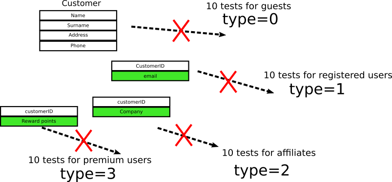

现在有4个通过外键关联的对象和全部报废的40个用例，因为其检查的字段已经不存在了。

_当然在这个例子中，可以通过不删除已有字段使得测试保持后向兼容_。实际应用中，大多是不可能的。有时后向兼容意味着你需要同时维护新旧两套代码(新功能前后)，导致项目变得臃肿。注意为了使得测试通过而不得不维护老代码本身也是一个巨大的误区。

实际系统中出现这个情况时，开发人员会向领导申请额外的时间用于修复用例。然后产品经理会把单元测试当做浪费时间的东西，因为它看起来阻碍了新功能。然后整个团队通过关闭这些失败用例放弃这个测试集。

上面的问题并不是测试，而是测试的编写方式。用例应该测试期望行为而非内部实现。上面的例子中应该在每个用例中应该严格检查业务需求而不是直接测试顾客类的内部结构。下面是用例的正确组成姿势：

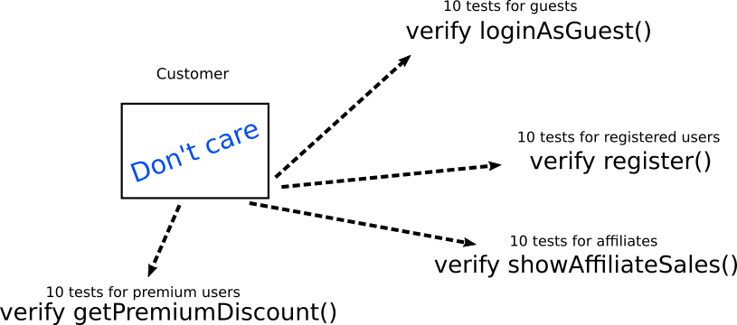

测试无需关注顾客对象的内部结构。只需关注其同其他对象/方法/函数的交互。其他需要用到的对象/方法/函数应该采用mock的方式。请注意，每种类型的测试都直接映射到业务需求，而不是技术实现（这总是一个很好的实践）

如果 _顾客_ 对象内部实现发生变化，测试校验代码不用变。唯一可能修改的地方是每个测试的启动代码，其应该集中至一个单一的辅助函数`createSampleCustomer()`或者其他相似的东西上(详见[误区9](#误区9-把测试代码当做二等公民))

当然，从理论上讲，被验证对象本身可能会发生变化。在实践中，`loginAsGuest()`和`register()`和`showAffiliateSales()`和`getPremiumDiscount()`同时发生更改非常罕见。在一个实际场景中，你很可能是重构10次而不是40次。

总的来说，如果你发现你在增加一个新功能之后总是不断修复已有测试，这说明你的测试代码与内部实现耦合太重了。

## 误区6: 过于关注测试覆盖率
代码覆盖率是软件从业人员最喜欢的指标。开发人员和项目经理之间已经（并将继续）就项目所需的代码覆盖率[进行了](https://testing.googleblog.com/2010/07/code-coverage-goal-80-and-no-less.html)[无尽的](https://softwareengineering.stackexchange.com/questions/1380/how-much-code-coverage-is-enough)[讨论](https://martinfowler.com/bliki/TestCoverage.html)。

每个人都喜欢谈论代码覆盖率的原因是因为它是一个易于理解和可量化的指标。对于大多数编程语言和测试框架而言，有几种方便获取的工具可以输出该指标。

_让我告诉你一个小秘密_：将代码覆盖率作为一个指标是完全无用的。没有“正确的”代码覆盖率标准。这是一个陷阱问题。你可以有一个100％的代码覆盖率的项目，但仍然存在错误和问题。你应该监控的真正指标是众所周知的CTM。

### 代码管测试度(CTM, Codepipes Testing Metrics)
(译注: codepipes为作者个人网站名称，以下指标都是他自己发明的)

如果你以前从未见过它们，这就是它们的定义：

|度量名|描述|理想值|通常值|存在问题的值|
|------|-----|-----|------|---------|
|PDWT|写测试的开发人员比例|100%|20%-70%|<100%|
|PBCNT|bug转测试比例|100%|0%-5%|<100%|
|PTVB|验证行为测试比例|100%|10%|<100%|
|PTD|确定性的测试比例|100%|50%-80%|<100%|

**PDWT**(写测试的开发人员比例)可能是所有指标中最重要的。如果你没有写过任何测试，那么谈论软件测试误区就毫无意义。团队中的所有开发人员都应该写测试。只有在配套一个或多个测试时才可以声明新功能 _完成_。

**PBCNT**(bug转测试比例)。每一个出现在生产中的bug都是写一个新的软件测试用例来验证相应修复的好机会。一个出现在生产中的错误只应该出现一次。如果你的项目在生产中多次出现错误（即使在其“修复”之后），那么你的团队将真正受益于此标准。详情参见[误区10](#误区10-没有把产品bug转化测试用例)。

**PTVB**(验证行为而不是实现的测试的百分比)。当主代码被重构时，紧密耦合的测试将会耗费大量时间修改。这个话题已经在[误区5](#误区5-测试内部实现)中讨论过了。

**PTD**(对总测试具有确定性的测试的百分比)。只当业务代码出现问题时，测试才应该失败。存在无明显原因间歇性失败的用例是一个在[误区7](#误区7-存在不稳定或者耗时的测试)中讨论的大问题。

如果在阅读完这些指标后，你仍然坚持为代码覆盖率设置一个固定数字作为目标的话，我会给你提供一个数字20%。这个数字应作为一个经验值使用，这是基于[帕累托原则](https://en.wikipedia.org/wiki/Pareto_principle)的最优值。 20%的代码会导致80%的错误，所以如果你真的想开始编写测试，你可以先从这部分开始。这个建议也与[误区4](#误区4-测试错误的功能)很好地结合在一起，我建议你应该先为你的关键代码编写测试。

不要试图达到100%的代码覆盖率。实现100%的代码覆盖率在理论上听起来不错，但基本上是在浪费时间：
* 你会浪费更多的精力，因为从80%到100%比从0%到20%要困难得多
* 代码覆盖率上升存在收益递减

在任何重要的应用程序中，都有某些场景需要复杂的单元测试才能触发。编写这些测试所需的努力通常会超过所涉及的风险，关于是否这些特殊场景在生产中失败过（如果是）。

如果你曾经在大型项目中工作过的话，你应该知道在代码覆盖率达到70%或80%后，想要给未测试的代码编写有效的测试会变得非常困难。

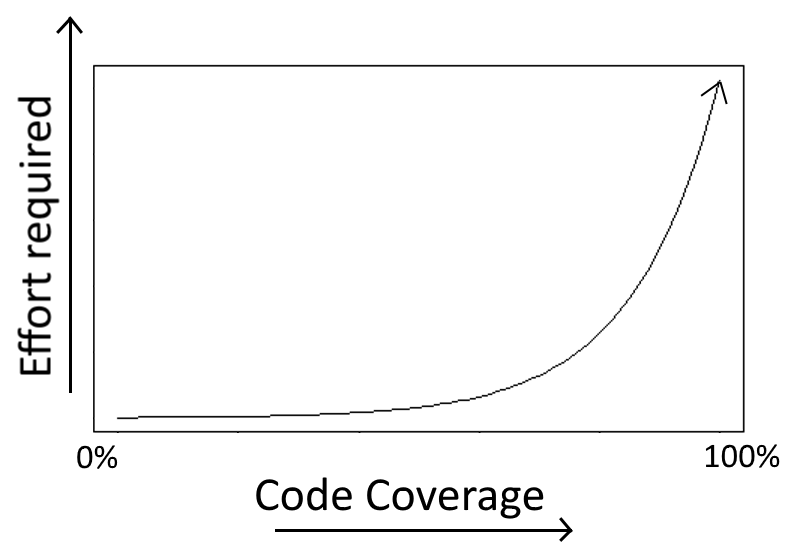

在类似的说明中，正如我们在[误区4](#误区4-测试错误的功能)中已经看到的那样，有一些代码路径从未真正在生产中失败，因此不建议为它们编写测试。与其把时间花在覆盖它们，不如把时间花在开发实际功能上。

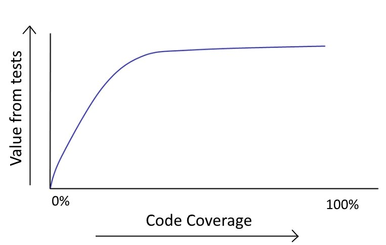

需要特定代码覆盖率作为交付要求的项目通常会迫使开发人员按顺序测试不重要的代码，或编写只验证底层编程语言的测试。这是对时间的巨大浪费，作为一名开发人员，你有责任向有提这种无理要求的管理层投诉。

总而言之，代码覆盖率**不**应该被用作表示软件项目质量。

## 误区7: 存在不稳定或者耗时的测试
这种特殊的误区[已经](https://martinfowler.com/articles/nonDeterminism.html)[被](https://testing.googleblog.com/2016/05/flaky-tests-at-google-and-how-we.html)[大量](https://testing.googleblog.com/2017/04/where-do-our-flaky-tests-come-from.html)[记录](https://semaphoreci.com/community/tutorials/how-to-deal-with-and-eliminate-flaky-tests)过，我只是为了完备性而将它包含进来。

由于软件测试是针对回归测试的早期预警，它们应始终以可靠的方式运行。失败的测试应该要引人关注，并且触发相应构建的人员应该立即排查测试失败的原因。

这种方法只能用于具备确定性失败的测试。一个时好时坏（没有任何代码变化）的测试是不可靠的，并且会破坏整个测试集。负面影响有两个：
* 开发人员不再相信测试结果并选择忽略它
* 即便稳定的测试用例失败了，在一群不稳定测试用例中你也很难发现它

团队中的每个人都应该很容易识别出失败的测试，因为它会改变整个构建的状态。另一方面，如果存在不稳定测试，很难知道新的失败是否真的是失败，还是不稳定测试导致的。

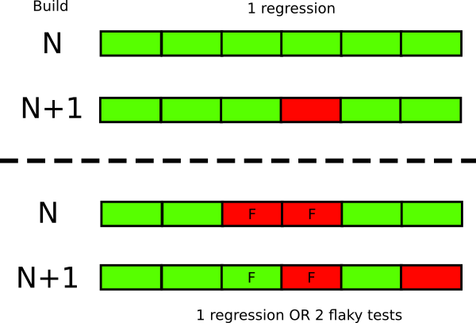

即使很少的不稳定测试也足以毁掉整个测试集的可信性。假如你有5个不稳定测试，运行一次构建，出现3个失败。这并不能直接证明是否一切都ok(因为失败来自不稳定用例集)，还是出现了三个bug。

另一个相似的问题是测试运行速度非常慢。开发人员需要在每次提交之后快速获取反馈(下一节也会详细探讨), 所以缓慢的测试会被逐渐忽略，甚至不再运行。

实际中不稳定和缓慢测试用例基本都来自集成测试和/或UI测试。越靠近金字塔顶层，出现不稳定测试的概率就越大。众所周知，处理浏览器事件的测试很难保证每次都对。集成测试中的不稳定性原因可能有很多种，但大多数原因都是测试环境及其依赖。

总之，你需要有一个十分可靠的测试集（即使它是整个测试集的一个子集）。在这个测试集中失败的用例意味着代码真有错，任何失败都意味着代码不能被部署至生产环境。

## 误区8: 手动运行测试用例
根据你所在组织的情况，可能已经有了几种类型的测试用例。单元测试，负载测试，用户验收测试是在代码投入生产之前 _可能_ 执行的常见测试集类型。

理想情况下，所有测试都应该自动化运行，无需任何人为干预。如果这是不可能的，至少所有关于代码正确性的测试（即单元和集成测试）都**必须**以自动化的方式运行。这样开发人员能够以最及时的方式获得关于代码的反馈。当你的头脑中代码还没忘记并且你尚未将工作切换到不相关功能时，修复bug会非常容易。

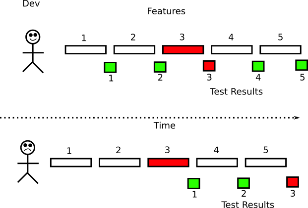

在过去，软件生命周期中最长的步骤是应用部署。随着基础环境向云演进，机器可以按需创建(虚拟机或容器的形式)，获取一台新机器的时间下降至分/秒级。这种模式转变让很多公司感到意外，因为他们还没有准备好处理日级甚至是小时级的部署。大多数现有的做法都是围绕着冗长的发布周期。如果公司希望尽快部署，那么在发布中等待手动批准"通过QA"是那些不再适用的过时做法之一。

尽可能快地部署表明你信任每一次部署。信任自动化部署需要对待部署代码有很高的信心。虽然有几种方法可以获得这种信心，但第一道防线应该是你的软件测试。然而，配备测试集以快速捕获缺陷只是方程式的一半。另一半是自动化运行测试(最好在每次提交之后)。

很多公司 _认为_ 他们熟练使用持续发布和/或持续部署。实际上并不是。真正成熟的CI/CD意味着 _在任意时间点_ 都有一个版本的代码可以部署。因此应用打好包等待"通过QA"并不是真正的CI/CD。

不幸的是，尽管大多数公司已经正确意识到应该自动化部署，因为人不仅容易出错还慢，但我仍然看到不少公司采用半手工的流程。我说的半手工是指尽管测试集已经自动运行了，但是还需要人来做些杂活比如准备测试环境或者在测试结束之后清理测试数据。这是一个误区，因为这并不是真正的自动化。测试的**所有**相关方面都应该自动化起来。

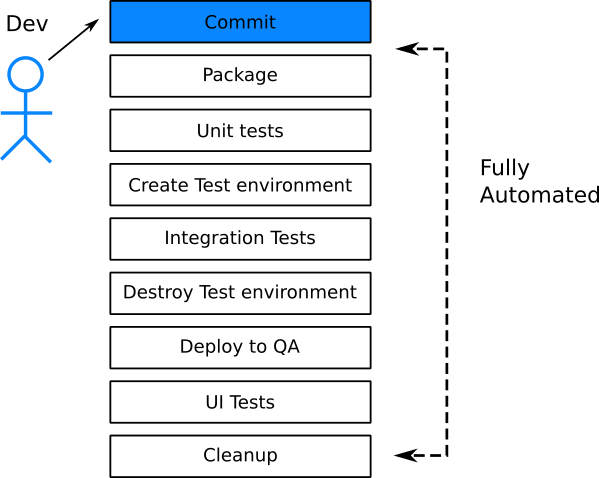

有虚拟机或者容器意味着可以非常容易地按需创建多个测试环境。即时为每个单独请求创建测试环境应该成为你所在组织的标准实践。这意味着每个新功能可以独立测试。一个问题很多的功能(也就是测试不通过)不应该阻塞需要同时部署的其他功能的发布。

一个简单的方法可以看出一个公司测试自动化程度，那就是观察QA/测试的工作日常。理想情况下，测试人员的工作就是向已有用例集添加测试用例。测试人员本身并不手动执行测试。测试集由构建服务器运行。

总的来说，测试应该是在幕后的构建服务器上无时不刻的运行着。开发人员应该在单个功能代码提交之后的5-15分钟获取到测试的结果。测试人员的工作应该是添加新用例和重构老用例，而不是手动执行用例。

## 误区9: 把测试代码当做二等公民
如果你是一位经验丰富的开发人员，那么在实现新代码之前，你总会花一些时间来构思它。关于代码设计有若干哲学，其中一些非常重要，已经有了自己的Wiki索引。比如：
* [DRY](https://en.wikipedia.org/wiki/Don%27t_repeat_yourself)
* [KISS](https://en.wikipedia.org/wiki/KISS_principle)
* [SOLID](https://en.wikipedia.org/wiki/SOLID_(object-oriented_design))

第一条是颇具争议的、最重要的一个，因为它强迫你无重复地实现代码然后在多个功能中进行复用。根据编程语言的不同，你可能还看到过其他的最佳实践原则和推荐设计模式。你们团队可能还有自己的指导原则。

然而，由于某些未知的原因，一些开发人员并不会在软件测试的代码上采用这些相同的原则。我见过有的项目有着设计良好的功能代码，但是测试代码中却遍布代码重复、硬编码变量、复制-粘贴片段和其他任何不允许在主代码中出现的低效问题。

把测试代码当做二等公民是说不通的，因为长远来看所有的代码都需要维护。测试在未来需要更新和重构。其变量和结构会变化。如果写测试时不考虑他们的设计，那么你的技术债务就会增加，并累加到主代码已有的债务之中。

尽量像你在设计功能代码一样设计你的测试代码。所有通用的重构技术也都应该用在测试代码中。作为一个起点：
* 所有的测试创建代码应该集中化。所有的测试应该采用相同的行为创建测试数据
* 复杂的验证代码片段应该抽出作为一个常用域内的特殊库
* 多次使用的mock和stub也不应该拷贝-粘贴
* 测试初始化代码应该在相似测试之间共享

如果你采用了静态分析、代码格式化或这代码质量工具，那么同样也在测试代码上配置使用。

总之，就是设计你的主功能代码一样设计你的测试代码细节。

## 误区10: 没有把产品bug转化测试用例
测试的目标之一是发现缺陷。正如我们在[误区4](#误区4-测试错误的功能)看到的，大多数应用都有一部分"关键"代码，大多数的bug都从其中产生。当你修复一个bug之后你要确定它不会再出现。达到这个目的的最好方式之一就是为该修复编写测试用例(无论单元测试还是集成测试或者都用)

产品中出现的bug是编写软件测试用例的绝佳参考：
* 它们表明该部分缺少测试以致于bug已经出现在生成上
* 如果你给这写bug写用例，那么其价值就很明显，因为他们防止软件的未来发布中再次出现。

我一直很惊讶有的团队(尽管有完备的测试策略)不为 _产品_ 中发现的bug编写测试用例。他们直接改正代码并修复bug。由于某些奇怪的原因，很多开发者认为只有在增加新功能的时候编写用例才有价值。

简直大错特错。从实际bug中获取的测试用例甚至要比新部署中新加入的用例有价值的多。毕竟你绝不会知道生产环境中的一个新功能的出错频率是多少(也许它是一个从不出错的非核心代码)。有测试用例是好的，但是价值就值得质疑。

另一方面，为实际bug编写的测试用例价值就大得多。不仅因为它验证了你的修复正确，还保证当相同区域发生重构时，你的修复依旧有效。

如果你加入了一个没有测试用例的老项目，这也是最明智地发挥软件测试价值方式。比起猜哪部分代码需要测试，你更应该关注已有的bug并用用例来覆盖它们。不久之后你的测试用例就可以覆盖代码的关键部分，因为根据定义来说，所有的测试都验证了经常出错的东西。[我建议的评价指标](#代码管测试度ctm-codepipes-testing-metrics)之一就包含了这个情况。

可以接受**不**写测试用例的唯一情况是你在产品中发现的bug与代码无关，而是由环境导致的。比如负载均衡的配置错误就不是靠单元测试能解决的。

总之，如果你不确定应该给哪些代码写测试用例，那就看看产品中出现的bug。

## 误区11: 拿TDD当做信仰
TDD，[测试驱动开发](https://en.wikipedia.org/wiki/Test-driven_development)(Test Driven Development), 像其他之前的理论一样，在布道师尝试说服公司无脑采用TDD作为唯一的开发模式之前，是一个很好的理论方法。撰写本文的时候这个趋势正在消失，但是我决定为了完备性提一下(因为这个企业界受这个误区的影响尤其严重)。

宽泛地说，当提到软件测试时：
1. 你可以在实现相应代码 _之前_ 编写测试用例
2. 你可以在实现相应代码 _同时_ 编写测试用例
3. 你可以在实现相应代码 _之后_ 编写测试用例
4. 你可以在实现相应代码时 _不_ 编写测试用例

TDD的核心原则之一是从是遵守第1项(在实现相应代码之前编写测试用例)。在编写代码之前编写测试用例是一个好的实践但并不总是最佳实践。

在实现代码前编写测试暗含了你很确定你的最终API，而这不一定。也许你面前有一份条理清晰的文档，因此你知道所要实现的接口的代码的每一个细节。但是其他情况下，你大概只能通过尝试一些事情，快速实验并向最终方案靠拢，而不是上来就有解决方案。

举一个更实际的例子，说明在初创公司盲目采用TDD是不成熟的。如果你工作在一个初创公司，你写的代码可能需要快速迭代，那么TDD是帮不上什么忙的。能够"通过"的代码你甚至可能想扔掉。本例中最好的策略是在实现代码 _之后_ 编写测试。

不写测试(第4项)也是一个有效的策略。正如我们在[误区4](#误区4-测试错误的功能)中看到的，有的代码不需要测试。给零碎代码写测试用例因为这是"TDD"的正确方式，但会让你无功而返。

无论如何，TDD狂热者无论什么情况下都痴迷于测试优先，是对理性开发者心理健康的巨大损害。这种痴迷已经在很多地方有记录，所以我希望在这个话题无需多言(搜索"TDD is crap/stupid/dead")。

这里我得承认有时候我会像下面这样实现代码：
1. 先写主功能
2. 然后写测试
3. 运行测试成功
4. 注释功能的核心代码
5. 运行测试失败
6. 取消注释代码，恢复至原始状态
7. 运行代码又一次成功
8. 提交代码

总的来说，TDD是一个好的理念，但是你不必每次都都遵守。如果你工作在世界500强，周围都是严谨的业务分析和清晰的实现要求，那么TDD大概是有用的。

反过来，如果你只是周末在家玩一玩新框架，了解它的工作原理，那还是**不要**遵守TDD了。

## 误区12: 不看说明书直接写测试用例
一个专业的开发人员需要对工作所需技能有充分了解。在一个项目开始之前你需要花费额外的时间去学习你要使用的技术。web框架层出不穷，先了解它的功能能写出更清晰高效的代码。

你应该同样尊重软件测试。因为有些开发人员把测试看低一等([误区9](#误区9-把测试代码当做二等公民)),他们从不肯坐下来好好学习一个测试框架的功能。而是从其他项目复制测试代码和例子，看一眼差不多能跑就行，但这不是一个专业人员应有的行为。

不幸地是，这种情况太多了。有人写了几个"辅助函数"和"公用实体"，但是却没有意识到测试框架已经通过内置或者插件化的方式提供了相同功能。

这些公用实体使得测试难以理解(特别是对于初级开发人员)， 因为其中充满了一些团队内才知道的、无法在团队/公司间传递的知识。我曾经几次用现成的标准库替换掉"聪明的内部测试方案"，两者能做一样的东西，但是后者更标准。

你应该花时间学习测试框架的功能。比如尝试发现他能做：
* 测试参数化
* mock和stub
* 测试setup和teardown
* 测试分类
* 测试条件运行

如果你也开发典型的web应用，为了理解相关最佳实践你最少需要了解：
* 测试数据生成器
* HTTP客户端库
* HTTP模拟服务器
* 变异/模糊测试
* DB清理/回滚
* 负载测试等

没有必要重新造轮子。这句话对测试也适用。也许你的应用确实很独特，存在一些极端情况，确实需要团队内部造一些公用实例。但是我敢打赌你的单元和集成测试根本就没啥特别的，因此写一些独特的测试用例是很令人怀疑的实践。

## 误区13: 因为无知而认为测试不好
虽然这是本文的最后一个误区，但这才是我写这篇文章的原因。当我在会议和聚会上碰到一些宣称 _所有的测试都是浪费时间_ 并且他们的应用压根不写应用也能很好运行的人的时候，我很失望。更多情况是一些人反对某种特定类型的测试(通常是单元或者集成测试)，就像[误区1](误区1-只有单元测试没有集成测试)和[误区2](误区2-只有集成测试没有单元测试)中看到的那样。

当我看到这类人时，我喜欢用几个问题来了解他们，去获取他们讨厌测试的原因。毫无意外地，都能归结到误区中。比如他们之前工作的公司测试速度很慢([误区7](#误区7-存在不稳定或者耗时的测试)), 或者需要不断重构([误区5](#误区5-测试内部实现))。被毫无理由地要求100%的测试覆盖率([误区6](#误区6-过于关注测试覆盖率))或者被想要把自己扭曲理解的TDD强加到整个团队中的TDD狂热者([误区11](误区11-拿TDD当做信仰))"伤到"。

如果你是上面这些人中的一个，那我真的理解你。我明白在这些有坏习惯的公司里工作是多么艰难。

过去项目里测试工作的不好体验不应该干扰你在测试新项目时的判断。公正地看待你的团队和项目，看看其中是否存在什么误区。如果有，那么是在以错误的方式进行测试，没有任何测试会让你的应用程序更好。很遗憾但这是真的。

团队遭受不良测试习惯影响是一回事，教导初级开发人员"测试就是浪费时间"是另一回事。不要做后者。有的公司并没有陷入本文提到的**任何**一个误区。努力找到他们吧！
