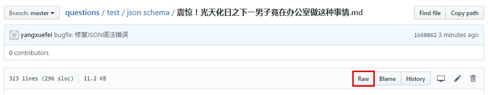
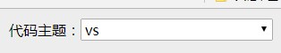
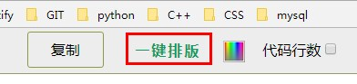
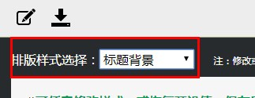
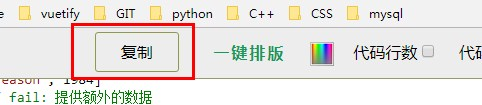

# 如何将markdown文章保持样式转换至微信公众号

## step 1
打开.md文件，如果显示的是渲染后的内容，那么请点击一下"Raw"按钮查看源码  

## step 2
`ctrl+A`, `ctrl+C`, `ctrl+V` 复制全部文本

## step 3
打开 [http://md.aclickall.com/](http://md.aclickall.com/), 将内容粘贴至左侧窗口，然后将右上角"代码主题"调整为"vs"  

## step 4
如果对标题样式不满意，可以点击上方的"一键排版"  
  
然后在左侧编辑窗口选择合适的排版样式  
  

## step 5
样式调整完毕之后，点击上方的"复制"按钮  
  
然后`ctrl+C`，将内容粘贴至微信公众号文章编辑窗口，检查无误后提交即可